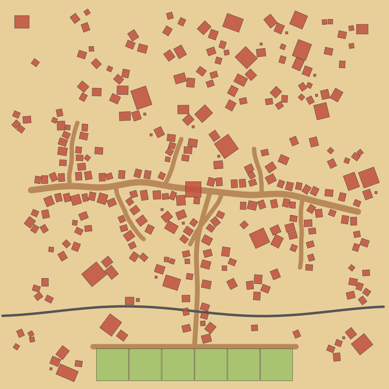

# Wild West storm-chaser – game scripts

Every system requested so far, as ready-to-use Roblox scripts. Paste them
into Studio (or sync them with Rojo) and press Play.



*Top-down preview of the generated layout (seed 1885). Red = buildings,
brown = dirt roads, grey = railroad, green = the 6 player plots.*

## What's included

| Feature | Where |
|---|---|
| Western town "Dustwater": bending main street, side streets at angles, buildings facing random directions, plaza + well, hamlets, farms, rail line + station, mine, Boot Hill. Fills 60% of the map; the rest is desert with dead trees, cacti, rocks and rolling tumbleweeds | `TownGenerator`, `Buildings` |
| 21 building types (bank with vault, 2 saloons with piano/stage, general store, sheriff + jail, hotel, church, post office, blacksmith, barber, doctor, undertaker, livery, shops, 5 home styles, farmhouse, barn, station), all with walk-in furnished interiors at Roblox-character scale (doors 5×8, 12-stud ceilings, working stairs) | `Buildings` |
| Blender models swap in automatically: put a Model named e.g. `Bank` in `ServerStorage.TownModels` | `Buildings` |
| Survivors spawn inside buildings (60%) and outside (40%). No names, only a **🍀 Luck** level | `SurvivorService` |
| Rescue: hold E on a survivor near your vehicle. They run out and sit in a passenger seat. Drive onto your plot's drop-off circle to get paid. **Each vehicle carries 1 survivor at a time** (`Config.Survivors.MaxPerVehicle`); the other seats are for friends | `SurvivorService` |
| Tornado picks vehicles up, spins them up the funnel and throws them across the map. Driver stays seated | `TornadoVehicleFling` |
| **Only the anime tornado** is allowed: any other tagged tornado is deleted | `TornadoVehicleFling` |
| Starter vehicle = normal pickup truck, 1.5× faster (50 → 75) | `Config`, `VehicleBuilder` |
| Short school bus = 2nd fastest (100), rows of seats inside | `Config`, `VehicleBuilder` |
| Kei truck = fastest (125) | `Config`, `VehicleBuilder` |
| Player plots built from the blueprint: 3-bay garage, bunkhouse (kitchen, bedroom, storm shelter), survivor drop-off, spawn pad, fenced yard + gate, driveway | `PlotService` |
| Cash: earned by dropping off survivors, server-side only | `DataService` |
| **Progress saves** when you leave and loads when you come back: cash, owned vehicles, survivor index, rescue count, leaderboard earnings. Saves on leave, every 2 min, right after purchases and on server shutdown, with retries. If saved data can't be loaded, that visit isn't saved, so it can't overwrite your real progress | `DataService` |
| **Infinite cash for the developer** (shows ∞, purchases are free) | `DataService`, `Config.DevUserIds` |
| Friend Boost: +10% cash per friend in the server (max +50%), "+" button invites friends | `DataService`, `UI` |
| Feedback mailbox at every plot: step in the orange ring or press E. Dark "Share Your Feedback" window. Developers get a "Read Feedback (dev)" button | `FeedbackService`, `UI` |
| 2 **global** leaderboards beside the plots: Top Earners All Time (left) and This Week (right) | `LeaderboardService` |
| Cartoon HUD in the style of the reference: Shop, Index, Vehicles, Home, cash, Friend Boost, tornado timer | `UI` |

## Where each script goes

Create these in Roblox Studio **with exactly these names and types**
(the file names in `src/` match):

```
ReplicatedStorage
└── WildWestShared            (Folder)
    └── Config                (ModuleScript)   ← src/shared/Config.lua

ServerScriptService
└── WildWest                  (Folder)
    ├── Main                  (Script)         ← src/server/Main.server.lua
    ├── Build                 (ModuleScript)   ← src/server/Build.lua
    ├── Buildings             (ModuleScript)   ← src/server/Buildings.lua
    ├── DataService           (ModuleScript)   ← src/server/DataService.lua
    ├── FeedbackService       (ModuleScript)   ← src/server/FeedbackService.lua
    ├── LeaderboardService    (ModuleScript)   ← src/server/LeaderboardService.lua
    ├── PlotService           (ModuleScript)   ← src/server/PlotService.lua
    ├── Remotes               (ModuleScript)   ← src/server/Remotes.lua
    ├── SurvivorService       (ModuleScript)   ← src/server/SurvivorService.lua
    ├── TornadoVehicleFling   (ModuleScript)   ← src/server/TornadoVehicleFling.lua
    ├── TownGenerator         (ModuleScript)   ← src/server/TownGenerator.lua
    ├── VehicleBuilder        (ModuleScript)   ← src/server/VehicleBuilder.lua
    └── VehicleService        (ModuleScript)   ← src/server/VehicleService.lua

StarterPlayer
└── StarterPlayerScripts
    └── WildWestClient        (Folder)
        ├── UI                (LocalScript)    ← src/client/UI.client.lua
        └── VehicleDrive      (LocalScript)    ← src/client/VehicleDrive.client.lua
```

Or with [Rojo](https://rojo.space): `rojo serve roblox/default.project.json`.

## One-time setup

1. **Your developer account:** put your Roblox user ID in `Config.DevUserIds`.
   If the game is owned by your own account, you already count as the developer.
2. **Saving:** Game Settings → Security → turn on *Enable Studio Access to API
   Services* (needed for cash, feedback and leaderboards in Studio).
3. **Anime tornado:** tag your anime tornado Model with the CollectionService
   tag `Tornado` and give it the attribute `TornadoStyle = "Anime"`. Delete
   every other tornado model and spawner.
4. **Tornado timer (bottom right):** your tornado spawner sets
   `ReplicatedStorage:SetAttribute("NextTornadoAt", workspace:GetServerTimeNow() + secondsUntilNext)`.
   "🌪️ NOW!" shows automatically while a tagged tornado exists.
5. **Map size:** set `Config.Map.Center` / `Config.Map.Size` to your play area.
   Plots sit along its +Z edge (`Config.Plots.Origin`).
6. **Blender buildings:** import each building as a Model named after its kind
   (`Bank`, `Saloon`, `HomeSmall` ...) into `ServerStorage.TownModels`. Put
   the model's pivot at the ground centre with the front door facing −Z.
   Optional: add invisible Parts named `SurvivorSpawn` inside.
7. **Performance:** the full town is about 25,000 parts. Turn on
   `Workspace.StreamingEnabled` for mobile players.

## Tuning

Everything is in `Config`: luck-level cash, vehicle speeds and prices,
tornado strength/throw distance, town seed and fill %, plot positions,
leaderboard size, feedback limits.

- Vehicle drives backwards on W → set `Config.InvertDrive = true`.
- Different town layout → change `Config.Town.Seed`.
- Your old starter had a different speed → set `Config.StarterBaseSpeed`
  to that value; 1.5× is applied automatically.

## How it was checked

- All files type-check with luau-lsp against the Roblox API definitions
  (0 errors).
- The server modules were run outside Roblox with stand-in Roblox classes: all 21
  building types, all 3 vehicles, the 6 plots, both leaderboards and a full
  town generation (305 buildings, 60% fill, 732 survivor spawn points) ran
  without errors. The preview above comes from that run.
- **Not yet tested inside Roblox:** driving feel, tornado throws, survivor
  pathfinding and DataStores need a Play test in Studio.
